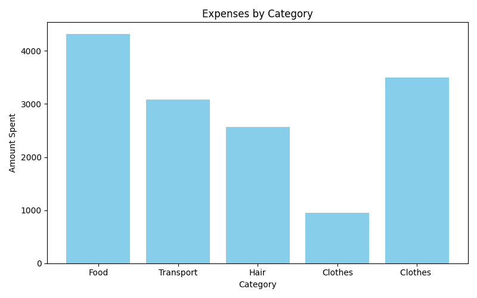
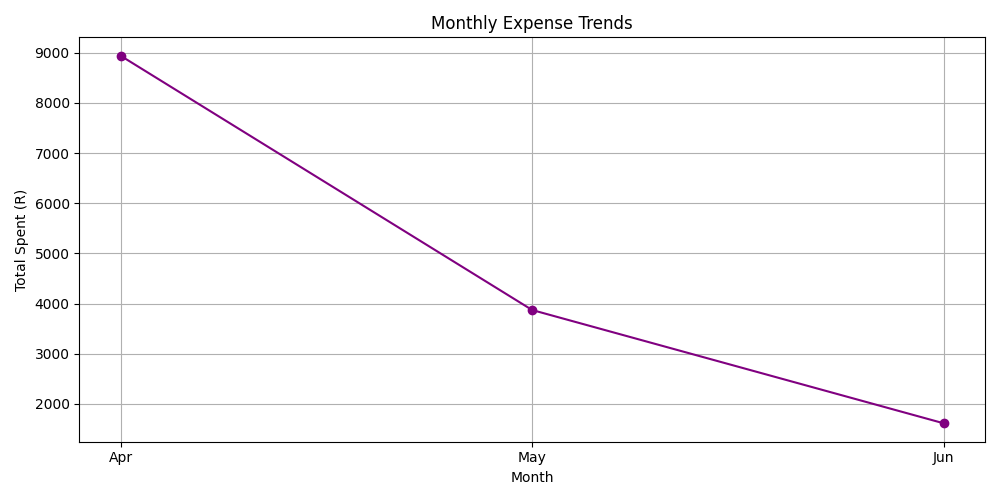

## 📉 Expense Tracker 

A simple command-line based Expense Tracker built with Python. It allows users to log daily expenses, track monthly spending, set budget limits, and visualize trends over time using graphs.

## Built With

🔸**Python** 🐍

🔸**Matplotlib** 📊


## ✨Features


 🔸Add new expenses (date, category, amount, description)

 🔸Log all expenses to [expense.csv](./expense.csv), which stores the data in a structured format.

 🔸 Set a monthly budget and get alerts when it's exceeded

 🔸 View all expenses in a table format

 🔸 Visualize monthly spending trends with line graphs

 🔸 Clean and simple CLI interface

## How to run

**1. Clone the repo**

```bash
git clone https://github.com/ZukiswaS/expense-tracker.git
cd expense-tracker
```

**2. Install dependencies**(if needed)

```bash
pip install matplotlib
```

**3. Run the app:**
```bash
python main.py
```

## Graph example

A sample monthly expenses graph



A sample visualization of the monthly expense trend:



## 👩🏽‍💻 Author
Made with ❤️ by Zukiswa Seboto

**GitHub**: @ZukiswaS


